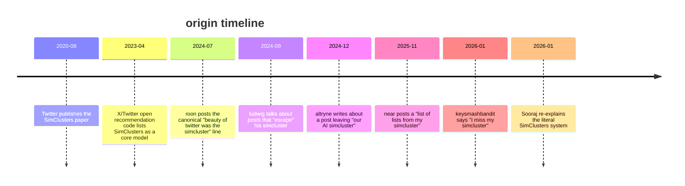
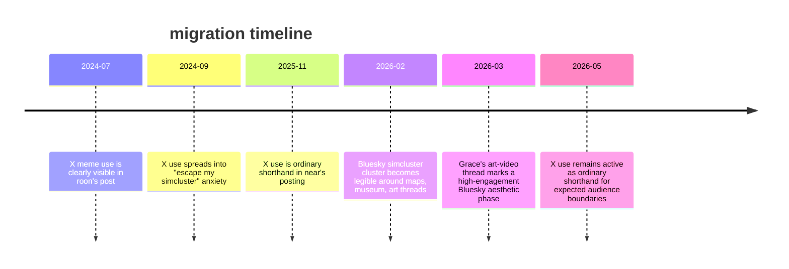
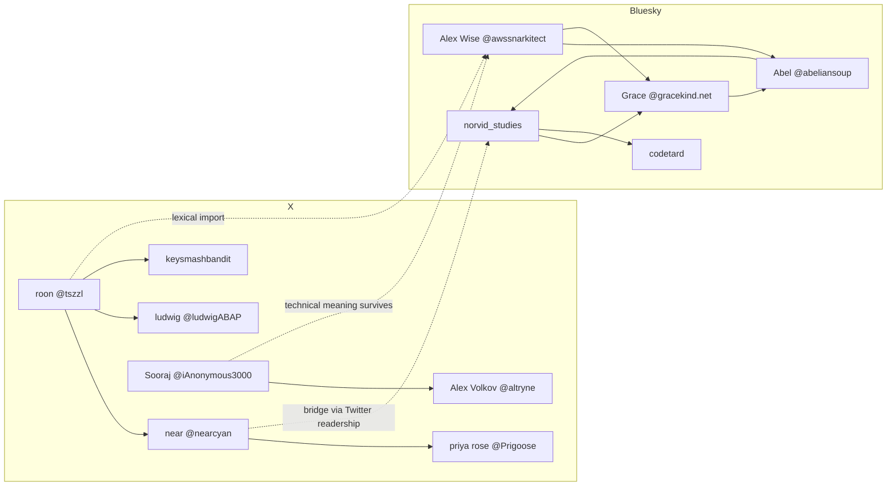

# simcluster on X and Bluesky

## executive summary

the clearest through-line is this: **“simcluster” starts as an internal/technical X-Twitter term, then becomes an X user metaphor for your algorithmic local scene, and only later turns up on Bluesky as a knowingly imported way to talk about subgraph-local reality, scene boundaries, and cartographic/art-play around the social graph**. The underlying technical term is documented in Twitter’s 2020 KDD paper on SimClusters, in X’s recommendation-code repository, and in current X Help language that still references “Simcluster” for recommendation similarity. Bluesky’s own docs, by contrast, describe timelines, feed generators, and custom feeds rather than any SimClusters-like named system. 

on **X**, the meme-like usage becomes clearly visible by **12 July 2024**, when roon/`@tszzl` posts the now-canonical lament beginning “the beauty of twitter was the simcluster”. From there the term gets normalised through several related uses: fear of a post “escaping” one’s cluster, complaints that the For You feed has destroyed the old cluster logic, and casual assumptions that a post will be shown only to one’s local audience. By late 2025 and early 2026, posters like `@nearcyan`, `@keysmashbandit`, `@altryne`, and `@Prigoose` are using “simcluster” as ordinary shorthand for the expected boundary of context, taste, and attention. 

on **Bluesky**, the first *clearly legible, indexed* cluster I could verify is **February 2026**, and it looks different in mood. There the word becomes less about literal recommender infrastructure and more about **social topology as folk phenomenology**: your tiny patch of the network feels like “the whole site”, people build maps of follower-pattern space, and the meme flowers into semi-aesthetic objects like the **“Simcluster Museum”**, **“SIMCLUSTER ART PROJECTS THREAD”**, **“THE SIMCLUSTER GETS A TIME MACHINE”**, and related visualisers such as **bluesky-map.theo.io** and **bskyshelf.space**. The Bluesky usage is usually more affectionate, more self-aware, and more cartographic than the X usage, though `@awssnarkitect.bsky.social` also uses it critically to puncture “everyone on Bluesky” claims. 

the best evidence of **migration from X to Bluesky** is not one smoking-gun repost chain but a stacked pattern: the term is X-native; X meme usages are earlier; Bluesky users repurpose it even though Bluesky does not officially use SimClusters terminology; and bridge figures like `@norvid-studies.bsky.social` explicitly link their Twitter account in their Bluesky bio and publish a Bluesky starter pack called **“people i read on twitter”**. That is less a clean handoff than a cultural import: the thing moves platforms and changes valence on the way over. 

## scope and method

this report prioritises **primary sources**: original X posts, original Bluesky posts and profiles, official X/Bluesky docs, and X’s published recommendation materials. Where useful, I also used secondary artefacts that visibly amplified the meme, such as Zvi Mowshowitz’s July 2024 roundup quoting roon and near. 

two limits matter. First, **Bluesky and X are both heavily JavaScript-driven**, and indexed snippets do not always expose the full thread context or every engagement counter. Second, for Bluesky especially, some post/profile counts were not surfaced in indexed primary snippets, so I mark those as unavailable rather than inventing them. That means the **chronology is strongest for clearly indexed posts**, while the claim “this is the absolute first-ever usage” would be too strong in a few cases. 

still, the evidence is plenty strong enough to map the meme’s **semantic arc**: technical term on X → folk concept on X → imported topology-joke on Bluesky. 

## from recommender jargon to meme template

the word **SimClusters** is not originally a meme. It is the name Twitter researchers gave a recommendation representation layer in a 2020 KDD paper: overlapping communities inferred from network structure, used to represent users and content for recommendation tasks. Twitter/X’s open repository later described SimClusters as a core model within the recommendation algorithm, and the `simclusters_v2` README says the representations power personalised tweet recommendation. X Help still refers to community similarity being based “in part on Simcluster”. 

that technical backstory matters because the meme retains a trace of the literal system. When Sooraj/`@iAnonymous3000` writes that SimClusters mapped users into roughly **145,000 overlapping groups** based on the follow graph, he is not joking about the existence of the mechanism; he is surfacing the literal engine that made the metaphor intuitive. The meme works because users already feel, at some level, that the feed has **cluster boundaries**, and X’s own technical literature confirms that this intuition was not wholly fanciful. 

Bluesky’s official framing is different. Its docs describe **timelines**, **custom feeds/feed generators**, and an AT Protocol-based architecture; the platform FAQ emphasises an “open social network” built by many people, and research on Bluesky’s 2024 public launch treats it as a Twitter-like but distinct network. That gap is the irony at the centre of the Bluesky meme: the word arrives from X, but on Bluesky it becomes a portable metaphor for **local social reality**, not a label for the official stack. 

the timeline above compresses the best-supported origin arc: formal term in 2020, public-facing algorithm discourse in 2023, then unmistakably memetic X usage from July 2024 onward. 

## X emergence and spread

on X, the meme first stabilises around **loss, leakage, and audience expectation**. roon’s 12 July 2024 post — “**the beauty of twitter was the simcluster**” — is the pivotal formulation: it names an older Twitter value proposition as the existence of semi-organic, self-organising local scenes, not maximal virality. Zvi Mowshowitz’s monthly roundup quoted the post and paired it with near’s agreement that virality-maximising algorithms are unaligned with human values, which is strong evidence that the line travelled quickly outside the original post. 

after that, the phrase becomes a compact idiom. ludwig’s late-September 2024 complaint about every non-tech banger that “**escapes my simcluster**” shifts the emphasis from discovery to **context collapse**: success outside the home cluster is experienced not as triumph but as contamination. Alex Volkov/`@altryne` intensifies the same logic in December 2024, writing that when a post “**left our AI simcluster**” it encountered hostile outsiders; here simcluster means a protective membrane around a taste/public-intellect niche. 

by early 2026 the term is plain vernacular on X. `@keysmashbandit` compresses the whole grievance into “**I miss my simcluster**”, with the indexed snippet surfacing strong engagement; `@nearcyan` can casually offer “a list of lists from my simcluster” and still draw **797 likes and 17 replies**; and `@Prigoose` can write, almost offhand, that she assumed a tweet “would just be shown to my simcluster”, treating the word as ordinary posting commonsense rather than insider jargon. 

the tone on X is therefore a mix of **satire, nostalgia, irritation, and defensive localism**. People do joke with it, but the core affect is usually wounded: the simcluster is the audience you meant, the people who get the bit, the radius in which you do not have to over-explain yourself. Once the post leaves that zone, the ancient comedy of manners becomes a public square riot. 

## Bluesky adoption and transformation

the first *clearly indexed* Bluesky concentration I could verify lands in **February 2026**, and it is already operating one register above mere complaint. `@norvid-studies.bsky.social` posts **“THE SIMCLUSTER GETS A TIME MACHINE”** on 17 February 2026; `@abeliansoup.bsky.social`’s profile snippet advertises both **“Welcome to the Simcluster Museum”** and a **“SIMCLUSTER ART PROJECTS THREAD”**; and in the same month Abel promotes **bskyshelf.space**, a tool to visualise your Bluesky follows, while norvid boosts **bluesky-map.theo.io**, an “interactive map of 3.4 million Bluesky users, visualised by their follower pattern”. The cluster has become literal cartography and then, almost immediately, museum-piece. 

that is the key semantic drift. On X, “simcluster” often means *my recommender-defined public*. On Bluesky, it becomes *the local subgraph that feels like reality from the inside*. `@awssnarkitect.bsky.social` says that if you think “everyone on Bluesky is dunking on you”, that only means you are “**part of a simcluster**” that likes doing so; in another post, the same account says one’s “small simcluster” can feel like “the entire internet”, and wishes for an interface that makes obvious there is no single “on here”. That is Bluesky simcluster discourse in miniature: not nostalgia for a better feed so much as a critique of **epistemic provincialism**. 

Grace/`@gracekind.net` pushes the meme into a more aesthetic register. Her 30 March 2026 post, which references a “**simcluster art videos**” thread, was indexed at **233 likes, 60 reposts, 9 quotes, and 47 saves**. That is notable not only for the engagement but for what it says the meme had become: by late March, “simcluster” on Bluesky was fertile enough to produce **art-video compilations** and metacommentary about those compilations. 

Bluesky use is thus more **affectionate, playful, and scene-making** than X use, though not without critique. The recurrent imagery is topological and archival: map, museum, art projects, time machine, lightcone, frontier, local ocean-drop epistemology. The meme is still about bounded publics, but on Bluesky it tends to feel less like “how dare the algorithm leak me” and more like “look at this strange little polis we accidentally built”. 

the migration story is not that Bluesky “invented” simcluster independently. It is that a distinctly X word arrives on Bluesky and gets re-authored into a scene-specific concept of **localism, feed relativity, and social-graph aesthetics**. 

## influence table and network clusters

the table below ranks profiles by **observed influence on the meme**, not just raw audience size. “audience signal” uses the follower or post-number data surfaced in indexed snippets during research; where those snippets did not expose a profile count, I say so plainly. 

| profile | platform | audience signal | notable simcluster evidence | role in the meme |
|---|---|---:|---|---|
| `@tszzl` roon | X | 366,436 followers  | 12 Jul 2024 post beginning “the beauty of twitter was the simcluster”; later amplified in Zvi’s roundup.  | origin-point of the clearly memetic X usage |
| `@nearcyan` | X | 163,553 followers  | “list of lists from my simcluster” drew 797 likes and 17 replies; near is also quoted sympathetically alongside roon.  | transition from lament to ordinary shorthand |
| `@ludwigABAP` | X | 47,162 followers  | “every non-tech banger … escapes my simcluster”.  | codifies the “escape the niche, lose context” variant |
| `@keysmashbandit` | X | 16,360 followers  | “I miss my simcluster” with strong indexed engagement.  | distilled, highly shareable complaint form |
| `@Prigoose` | X | 6,536 followers  | assumed a tweet would be “shown to my simcluster”.  | naturalises the term into everyday posting talk |
| `@altryne` | X | 41,057 followers  | wrote about a post leaving “our AI simcluster” and reaching “almost 5M impressions”.  | extends the term into AI-Twitter boundary discourse |
| `@awssnarkitect.bsky.social` | Bluesky | follower count not surfaced in indexed primary snippet  | “part of a simcluster”; “small simcluster feel like the entire internet”; “no ‘on here’”.  | strongest Bluesky theorist of simcluster-localism |
| `@abeliansoup.bsky.social` | Bluesky | follower count not surfaced in indexed primary snippet; one related post showed 45 likes  | “Welcome to the Simcluster Museum”; “SIMCLUSTER ART PROJECTS THREAD”; bskyshelf visualiser.  | principal curator/cartographer of the Bluesky phase |
| `@norvid-studies.bsky.social` | Bluesky and X | Bluesky follower count not surfaced; active on both platforms  | “THE SIMCLUSTER GETS A TIME MACHINE”; promoted the 3.4M-user Bluesky map; created starter pack “people i read on twitter”.  | bridge account linking X readership and Bluesky repurposing |
| `@gracekind.net` | Bluesky | 6.9K followers  | “simcluster art videos” post index showed 233 likes, 60 reposts, 9 quotes, 47 saves.  | helps turn the meme into a higher-engagement aesthetic object |

the observed network looks less like one neat tree and more like **three overlapping amplification clusters**. On X there is a **nostalgia/local-context cluster** around roon, ludwig, keysmashbandit, and Prigoose; an **algorithm-realist cluster** around near, altryne, and Sooraj explicitly binding the folk term back to recommender mechanics; and on Bluesky a **cartography/aesthetic cluster** around Abel, norvid, Grace, awssnarkitect, and adjacent creators. 

this graph is **qualitative**, not a hard repost graph: it is inferred from visible quotes, replies, starter packs, profile links, and thematic carry-over in indexed sources. Still, it captures the important fact that Bluesky simcluster discourse is not floating free; it is downstream of both **X’s technical mythology** and **X’s folk complaint register**. 

## takeaways and open questions

the cleanest reading is that **“simcluster” names three different things at once**. First, on the record, it is an X/Twitter recommender primitive. Second, on X-as-lived, it becomes the felt boundary of one’s intended audience. Third, on Bluesky, it becomes a portable way to talk about local graph reality, scene capture, and the comic/aesthetic absurdity of mistaking your tiny corner for the whole sky. 

that is why the meme survives migration. It is technical enough to feel *true*, but vague enough to become social folklore. On X it mostly means **“the people who should have seen this”**. On Bluesky it more often means **“the people through whom reality is currently reaching me”**. Same word, different form of captivity. 

the strongest evidence of X → Bluesky migration is cumulative rather than singular: X has the term first; Bluesky does not use it officially; Bluesky bridge profiles explicitly maintain Twitter links and a “people i read on twitter” starter pack; and the Bluesky phase preserves the old word while changing its payload. That is classic meme migration with semantic drift, not convergent invention. 

the main open questions are modest but real. I could not verify the **absolute first-ever** Bluesky usage from indexed primary material; some Bluesky follower counts and repost counts were not surfaced by indexed snippets; and a full repost/quote network on either platform would require direct API collection beyond what the indexed public pages exposed. So the broad map is solid, but some edges remain a little mist-lit, like a city seen from the train just before dawn. 