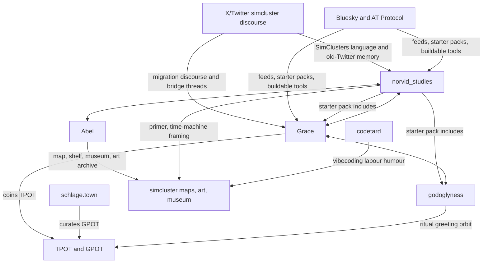

# The Simcluster Meme Ecosystem on Bluesky

## Executive summary

in this milieu, **simcluster** is best understood as a self-aware name for an algorithmically adjacent micro-public: a cluster of posters who know they are a cluster. the phrase almost certainly borrows from **X/Twitter’s SimClusters** system, which X’s open-sourced code and help materials describe as a community-based representation layer used for recommendations; an early X usage in July 2024 was already lamenting that “the beauty of twitter was the simcluster”, meaning the organic communities that once made the feed feel alive. by mid-2025, Norvid was explicitly predicting that “the simcluster” would become more important on Bluesky, so the later Bluesky usage looks less like a fresh coinage than a migration and re-naturalisation of an X-native concept. there is also a separate 2025–26 product called **Simcluster**, which is not what this report is about.

within the **Norvid / Grace** orbit, the meme is not merely descriptive. it is *productive*. Grace names a part of the milieu **“TPOT: This Part Of Terra”** and later jokes that on Bluesky they call it **“Tech-Forward Early Adopters”**; Brendan Schlagel spins out **“gpot (good part of tpot)”** as a more selective positive subset; Abel builds maps, shelves, and a “simcluster museum”; and Norvid posts a **“PRIMER”** thread with the title-card joke **“THE SIMCLUSTER GETS A TIME MACHINE.”** this is a scene that keeps making tools, glosses, and archives about itself.

the dominant affect is **guarded tenderness rather than pure cynicism**. public pack descriptions stress “friendly ambitious nerds”; Eugene Vinitsky’s surfaced bio says “Anti-cynic”; the recurrent **“gm fellow top chickens”** formula is openly affectionate; and even the sharper posts are usually complaints that communities are failing to put real effort into the thing they ostensibly value. the edge is there, but it is usually an edge against slop, drift, retreat, or edgelord capture. **vibecoding** sits inside this atmosphere as both earnest practice and labour satire, which is why the joke about getting up and going to the **“book vibecoding factory”** lands so cleanly.

the migration is **real but incomplete**. Norvid still links X from Bluesky and still posts on X; Grace explicitly described herself as following simcluster threads “between twitter and bsky”; Norvid complained on X that Twitter buries longposts unless they are on Bluesky; and Grace said in May 2026 that Bluesky’s discoverability was now better than Twitter’s. the result is best read as a **bi-platform sphere** whose centre of gravity is moving toward Bluesky because Bluesky’s feed tooling and open AT Protocol ecosystem make self-curation, self-observation, and weird little side-tools easier to build.

## Scope and caveats

this report uses **publicly indexed Bluesky profiles and posts, X/Twitter search snippets, official Bluesky/X documentation, public starter-pack indexes that expose public list membership, and authors’ own public sites**. that gives a solid view of the *visible* meme ecology, but not a full firehose analysis. a practical limitation is that many Bluesky pages are JavaScript-heavy in public view, while some direct X opens in this environment return little or no readable page body, so some thread context and some follower figures remain partial or snippet-dependent. where that happens, i say so.

there is also a **homonym problem**. “simcluster” can refer to at least three things online: Twitter/X’s SimClusters recommender machinery; a separate AI/social-game startup called Simcluster; and this folk-social term inside a Bluesky/X poster network. all three showed up in retrieval, so disambiguation matters. in what follows, **simcluster** means the *meme ecosystem and social cluster* unless i explicitly say otherwise.

## Origin and structure

the best origin hypothesis is that this usage begins as a **folk reappropriation of Twitter’s own recommender vocabulary**. Twitter/X’s public codebase describes SimClusters as a sparse, overlapping community representation layer used across recommendation tasks, and X help pages still refer to “simcluster-similarity” in recommendations. by July 2024, Roon was already using **“the simcluster”** colloquially on X to mean the organic, self-organising communities that used to dominate his feed. that shift—from technical recommender primitive to lived social unit—is the key semantic move. Norvid’s later remark that the simcluster would become more important on Bluesky strongly suggests that this move then migrated platforms.

inside the Grace-centred part of the network, **TPOT** is the most important local re-labelling. Grace publicly posted **“TPOT: This Part Of Terra”** in November 2024 and later attached the line **“Everyone’s TPOT is different. This is mine.”** to the associated starter pack. by February 2026, the same orbit was riffing that on Bluesky they do not say TPOT, they say **“Tech-Forward Early Adopters,”** which reads like both a managerial euphemism and a self-own. Brendan Schlagel’s later **“gpot (good part of tpot)”** tightens the social definition: curious, creative, thoughtful, positive-energy posters who miss “threadapalooza” and enjoy links and weird events. that is not a joke *about* community so much as an attempt to **curate** one.

**top chickens** appears to be the scene’s most recognisable phatic greeting. in the retrieved sample, Grace is already associated with **“gm fellow top chickens”** by December 2024, and by May 2026 other posters were meta-commenting on the whole “gm top chickens” situation or using the phrase to address Grace directly. the term does not seem to name a formal subgroup so much as a lightly mock-aristocratic way of greeting whoever is in the feed, on the wavelength, or in the room. it is barnyard pecking-order language with the aggression drained out and the warmth left in. that is an inference, but it is the simplest one that fits the public usage.

Bluesky’s own architecture helps explain why this meme thickens there. Bluesky says it wants feeds to become more central, explicitly frames the “Atmosphere” as an ecosystem of apps and tools on the same protocol, and stresses that anyone can spin up feeds or build tools for live moments and community use. that affordance profile matches what this cluster actually does: it makes starter packs, experimental clients, maps, shelves, museum viewers, and other meta-tools that turn a recommendation-shaped public into an object the public can look back at.

## Key accounts and relationships

two public starter packs are the clearest public skeleton of the network. **Norvid’s starter pack** is broader and more eclectic in the surfaced portion, including Grace, thebes, godoglyness, yonderdavid and a mix of ML, macrohistory and aesthetically intense accounts. **Grace’s TPOT** is smaller, more explicit, and more AI/tech-intellectual in tone, surfacing people such as Simon Willison, Eugene Vinitsky, Jessica Hullman, Michael Nielsen, eva, alice and others. the overlap is real, but the emphasis is a bit different: Norvid’s side looks more like a *readerly / mapping / concepts* orbit, Grace’s more like an *AI discourse / personal-intellectual / open-web* orbit.

the diagram below is interpretive rather than exhaustive. it is built from public starter packs, repeated mentions, and indexed interaction traces. it should be read as a **minimum visible graph** of the ecosystem, not as a complete social network extraction.

### Key accounts

| Account | Public description or observed role | Followers surfaced in retrieved snippets | Representative post or artefact |
|---|---|---:|---|
| **norvid_studies** | Bluesky bio: “charts and graphs”; X bio: ecology, macrohistory, evolution, complex adaptive systems; acts as a cross-platform simcluster amplifier and scene narrator | **X:** 5,305; **Bluesky:** not surfaced in retrieved profile snippet | **“PRIMER”** / **“THE SIMCLUSTER GETS A TIME MACHINE”**; later on X: **“scrolling simcluster museum”** |
| **Grace** | Bluesky bio: **“A latent space odyssey”**; public writer/commentator around AI, open-web culture and model behaviour; the clearest lexical setter for TPOT | **Bluesky:** 6.9K; **X:** not surfaced | **“TPOT: This Part Of Terra”**; later riffs on **“Tech-Forward Early Adopters”** and says Bluesky discoverability now exceeds Twitter’s |
| **Abel** | tool-builder and archivist around the cluster; associated with Bluesky maps, shelves, and the simcluster museum / art archive | not surfaced | **Bluesky map** post; profile snippets also surface **“SIMCLUSTER ART PROJECTS THREAD”** and “all media is pulled from the Simcluster Art Megathread” |
| **godoglyness** | ritual-aesthetic node; bio foregrounds “friend to machine minds” and mythic / dreamlike phrasing | **Bluesky:** 1.2K | surfaced with Grace-associated **top chickens** greetings and acts as a recurrent reply/liked-by node in Grace-related threads |
| **codetard** | hacker / builder with an overt **vibecoding** register; bio says “former, current, and future user” and “cordycepted AI maximalist” | **Bluesky:** 593 | profile surfaces the **“book vibecoding factory”** joke; Norvid’s time-machine frame appears to quote or build off codetard’s post |
| **schlage.town / Brendan Schlagel** | community organiser and boundary-setter in the wider TPOT migration orbit; publicly curates **GPOT** as a positive subset | not surfaced in primary snippet set | **“gpot (good part of tpot)”**: “curious + creative + thoughtful + positive energy … people who miss threadapalooza” |

outside this compact core, **croissanthology**, **thebes / vgel**, **yonderdavid**, and other academically or aesthetically adjacent accounts form a wider penumbra. Norvid’s starter pack includes Grace, thebes, yonderdavid and godoglyness in the surfaced segment, which is a decent public proxy for who he sees as worth clustering with.

## Vocabulary, tone, and aesthetics

### Recurring terms

| Term | Working definition in this ecosystem | Example |
|---|---|---|
| **simcluster** | a recommendation-shaped social blob that posters experience as a real scene; likely borrowed from Twitter/X’s SimClusters and then folk-socialised into an identity term | “the beauty of twitter was the simcluster” / “you’re part of a simcluster that likes to dunk” / Norvid: it will matter on Bluesky |
| **TPOT** | Grace’s label for a slice of the network: **“This Part Of Terra”**; later also a broader in-group shorthand for the cluster being curated | “TPOT: This Part Of Terra” / “Everyone’s TPOT is different. This is mine.” |
| **Tech-Forward Early Adopters** | ironic expansion / translation of TPOT into managerial jargon; a joke that also reveals how the group is perceived from outside | “On bsky they don’t say TPOT, they say ‘Tech-Forward Early Adopters’” |
| **GPOT** | Brendan’s curated positive subset: the “good part of tpot”, explicitly pruning edgelords and keeping creative, thoughtful, link-sharing energy | “friendly ambitious nerds” who miss “threadapalooza” |
| **vibecoding** | the broader AI-coding term coined by Andrej Karpathy, but locally used both straight and ironically, often as a shorthand for messy but generative making | Karpathy: “fully give in to the vibes”; codetard: “book vibecoding factory” |
| **top chickens** | affectionate in-group greeting; not a formal faction so much as a phatic salutation for people on the feed / in the current social wavelength | “gm fellow top chickens” |
| **prompts flow downward** | adjacent AI-management metaphor for hierarchical decomposition of work; important to this world of thought, but i did **not** retrieve a Norvid/Grace post using the exact phrase | “The prompts flow downward. The verification flows upward.” |

### Tone, themes, and rhetorical devices

the **themes** are unusually consistent across the public material: algorithmic self-consciousness, AI-tool use, scene curation, old-Twitter nostalgia, open-web buildability, and a recurrent concern with keeping a community both *interesting* and *non-soul-destroying*. the cluster keeps reflecting on its own feed conditions, its own discoverability, and the social consequences of platform design. that recursive quality is why “simcluster” works so well as a name: the scene treats itself as a social object generated by recommendation systems, then starts editing that object by hand.

the **tone** is a mix of mock-bureaucratic humour and genuine civic feeling. the bureaucratic side shows up in phrases like **“Tech-Forward Early Adopters”** and in the constant rebranding of a vibe into quasi-administrative categories. the civic side shows up when Grace complains that people retreat instead of building the thing they say they want, or when GPOT is defined not as dominance but as **curiosity, thoughtfulness, positivity, links, and weird events**. in other words, the scene is not anti-cynical because it lacks sharpness; it is anti-cynical because it wants a working internet public and thinks that requires active cultivation.

the recurring **rhetorical devices** are fairly distinctive. there is the **title-card gag**—Norvid’s “THE SIMCLUSTER GETS A TIME MACHINE.” there is the **mock institution**—the museum, the art megathread, the primer. there is **occupational satire**—the vibecoding factory. and there is **ritual salutation**—“gm fellow top chickens.” perhaps the cleanest single device, though, is **algorithmic metonymy**: instead of saying “your local in-group is doing this”, posters say “your simcluster” is doing it, as if both the social graph and its recommender substrate have become part of everyday folk psychology.

the **aesthetics** are equal parts charts-and-graphs, machine-spirits, and early-web play. Norvid’s self-branding is almost comically abstract—“charts and graphs.” Grace’s is dreamier—“A latent space odyssey.” godoglyness leans outright mythic: “friend to machine minds” and “living Ariadne’s desperate dream.” around them are backrooms Bluesky clients, follower-pattern maps, shelves, museums, and starter packs. visually and rhetorically, it is less corporate-tech than **post-forum, quasi-occult, open-protocol indie-tech**, with a strong tolerance for ornate bios and self-mythologising.

## Timeline, migration, prevalence, and gaps

### Timeline of notable posts and migrations

| Date | Event | Why it matters |
|---|---|---|
| **July 2024** | Roon posts that “the beauty of twitter was the simcluster” | earliest strong attestation in the retrieved sample of **simcluster** as a folk-social term rather than a purely technical recommender label |
| **November 2024** | Grace posts **“TPOT: This Part Of Terra”** | first clear public naming of the Grace-centred subcluster |
| **November 2024** | Grace attaches **“Everyone’s TPOT is different. This is mine.”** to the starter-pack framing | turns TPOT from a phrase into a **curatorial social object** |
| **December 2024** | Grace-associated **“gm fellow top chickens”** usage is visible in public indexing | earliest sampled trace of the most recognisable in-group greeting |
| **May 2025** | Brendan launches **GPOT**, the “good part of tpot” | signals that TPOT now names a broader scene with positive and negative boundary work inside it |
| **Late 2025** | Grace comments that she is following simcluster threads “between twitter and bsky” | explicit evidence of the scene operating **across both platforms at once** |
| **February 2026** | Grace / adjacent posters riff that Bluesky says **“Tech-Forward Early Adopters”** instead of TPOT | shows the meme being translated into Bluesky-native / managerial language |
| **February 2026** | Norvid posts **“PRIMER”** with **“THE SIMCLUSTER GETS A TIME MACHINE”** | marks the scene’s self-conscious memetic maturity on Bluesky |
| **February–March 2026** | Abel’s map / shelf tooling and the surfaced **Simcluster Art Megathread** and **museum** references appear | shows the meme ecosystem becoming an archive / interface / art object |
| **May 2026** | Grace says Bluesky’s discoverability is now better than Twitter’s; top-chickens posts and museum references continue in late May | confirms that the migration is not just symbolic; the day-to-day social affordances are now being judged in Bluesky’s favour |

### Migration dynamics

the migration story is less “everyone left X” than **“the social base split, then the buildable part of the culture moved first.”** the background grievance is old-Twitter community loss: Roon’s complaint about the simcluster becoming diffuse among slop is the cleanest statement of that. Norvid then complains that Twitter buries longposts unless they are posted on Bluesky. Grace, from the other side, is frustrated not that Bluesky failed, but that TPOT people gave up on it too quickly—because communities take effort. by May 2026 she is openly saying Bluesky discoverability is better. the through-line is not merely moral revulsion at X; it is also a practical judgment that Bluesky is now a better surface for **finding, curating, and extending** the right cluster.

that judgement is reinforced by the platform’s affordances. official Bluesky writing stresses feeds, tools, and the open AT Protocol ecosystem, and the retrieved public material shows this network actually *using* those affordances: a backrooms client, a follower-pattern map, a shelf visualiser, starter packs, and a museum-style viewer. if a simcluster is a group that has become legible to itself, Bluesky makes it unusually easy for that group to build **instruments of self-legibility**. that is a stronger explanation of the migration than any simple left/right or pro/anti-X story.

### Prevalence, geography, language, and gaps

in the retrieved sample, **TPOT**, **top chickens**, and **vibecoding** recur frequently enough to produce multiple indexed posts, profiles, or pack descriptions, while **simcluster** itself is denser and more scene-specific. the exact phrase **“prompts flow downward”** did *not* appear in a retrieved Norvid/Grace post and looks, on current evidence, more like adjacent AI-workflow discourse than a native shibboleth of this specific meme cluster. i would therefore rank prevalence, in *this* sample, roughly as: **TPOT / top chickens / vibecoding** as common scene vocabulary, **simcluster** as the higher-order self-name, and **prompts flow downward** as nearby conceptual vocabulary rather than a core idiom. that last point is an inference, but it matches the retrieval.

the scene is **overwhelmingly anglophone** in the public traces i retrieved, but also plainly transnational. surfaced bios in Grace’s TPOT include a **Bay Area** account, a **London** builder, an **Australia**-based “tpot camp” organiser, trans/queer techno-aesthetic bios from **NYC**, and multilingual cues such as **she/她** and **日本語**. that is a useful cultural signal: the ecosystem does not read like a single-city clique so much as an online, English-first, somewhat queer-coded and AI/tech-literate network with distributed urban nodes.

the main **data gaps** are straightforward. first, direct X pages are often snippet-only in this environment, so some migration threads can only be reconstructed from search results rather than full thread bodies. second, Bluesky’s public pages are heavily JS-dependent, so some quote-post structure and some follower counts stay hidden unless surfaced in search indexing. third, at least one third-party starter-pack directory gives a **2026** creation timestamp for Grace’s TPOT pack even though Grace herself was publicly posting the TPOT link in **November 2024**, so directory timestamps should be treated as *index artefacts unless corroborated by the original post*. none of these gaps overturn the main picture, but they do limit precision.

on balance, the strongest reading is this: **simcluster** is the name this network gives to the strange fact that an algorithmic cluster can become a conscious miniature public, and then start building mirrors for itself. Norvid supplies the charts-and-graphs, primer, and scene narration; Grace supplies the names, sublabels, and much of the norm-setting; Abel and others supply the interfaces; and the rest of the orbit keeps the thing alive by greeting, curating, and arguing about what sort of cluster it wants to be.